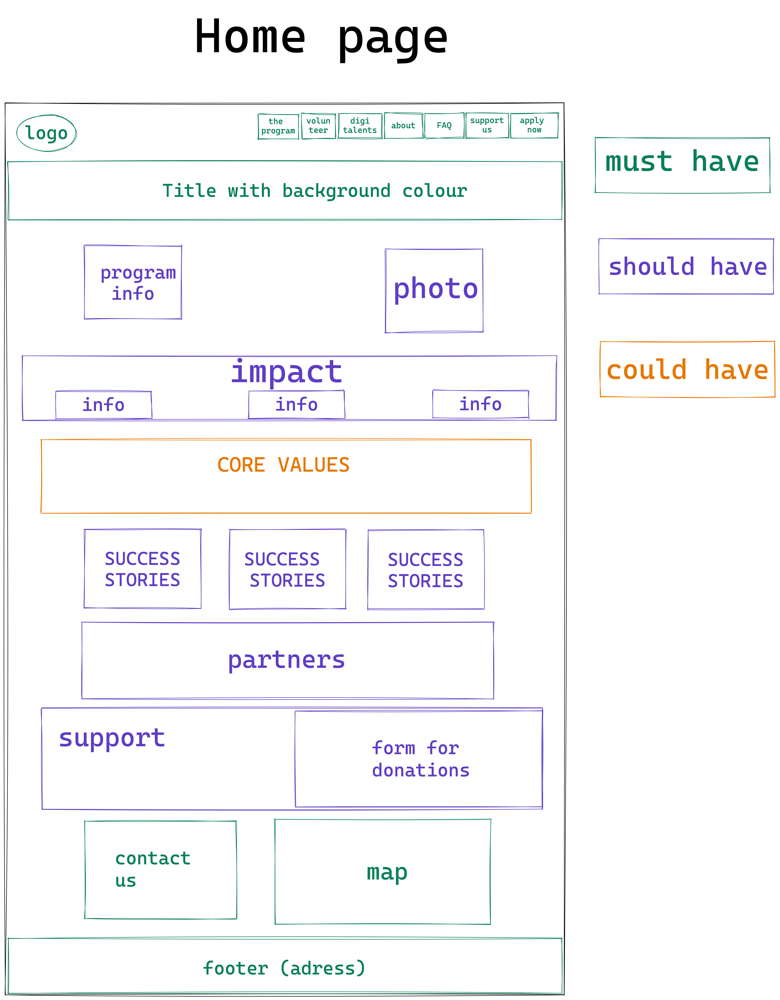
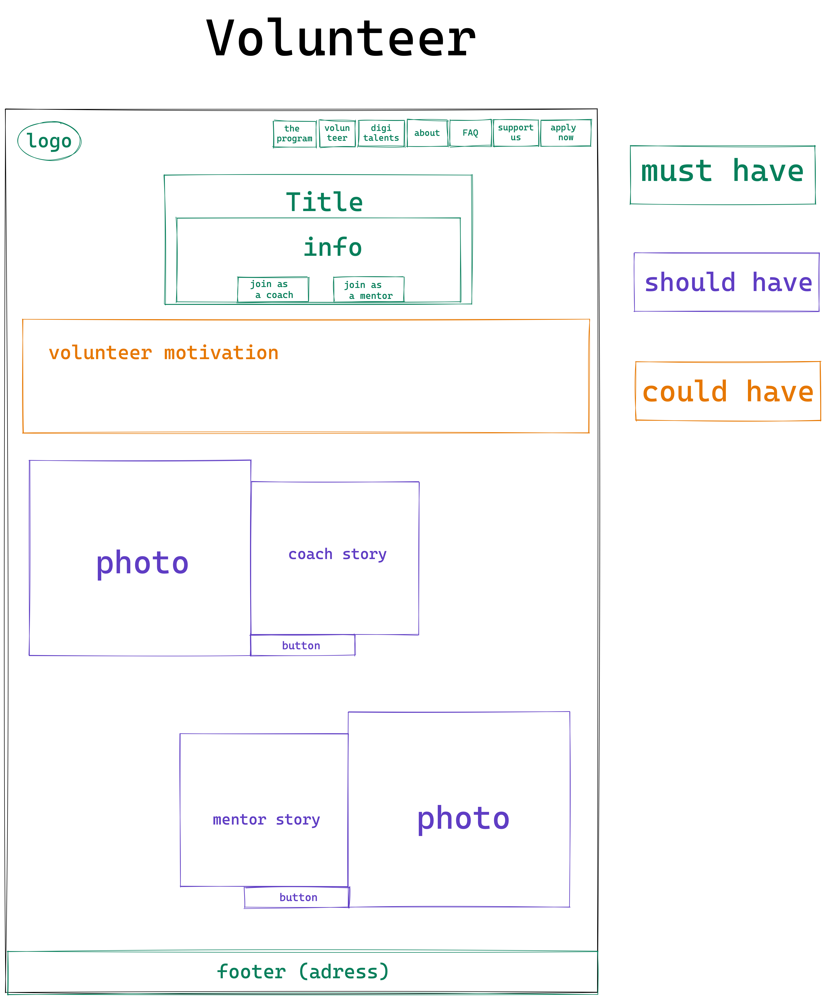
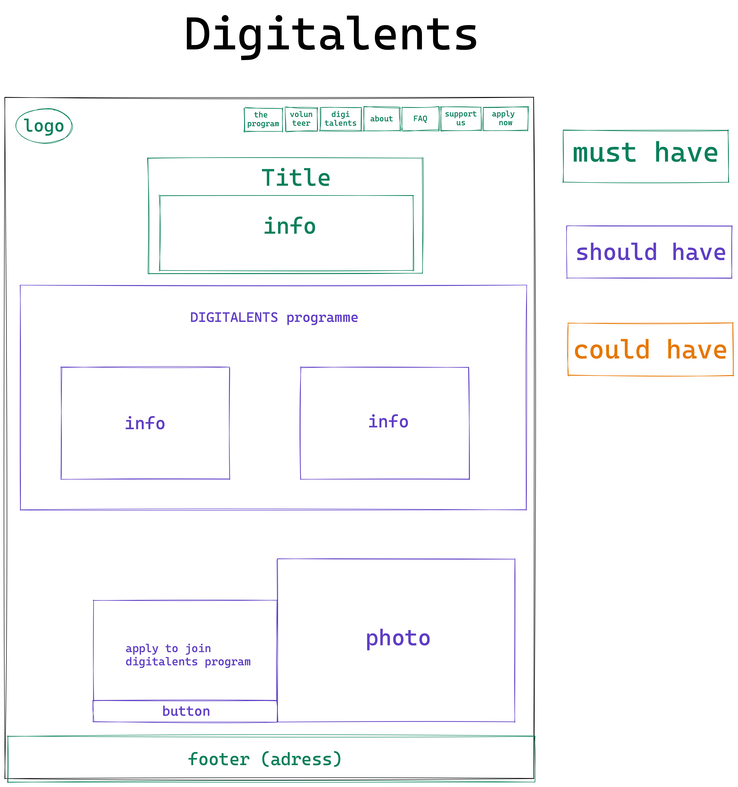
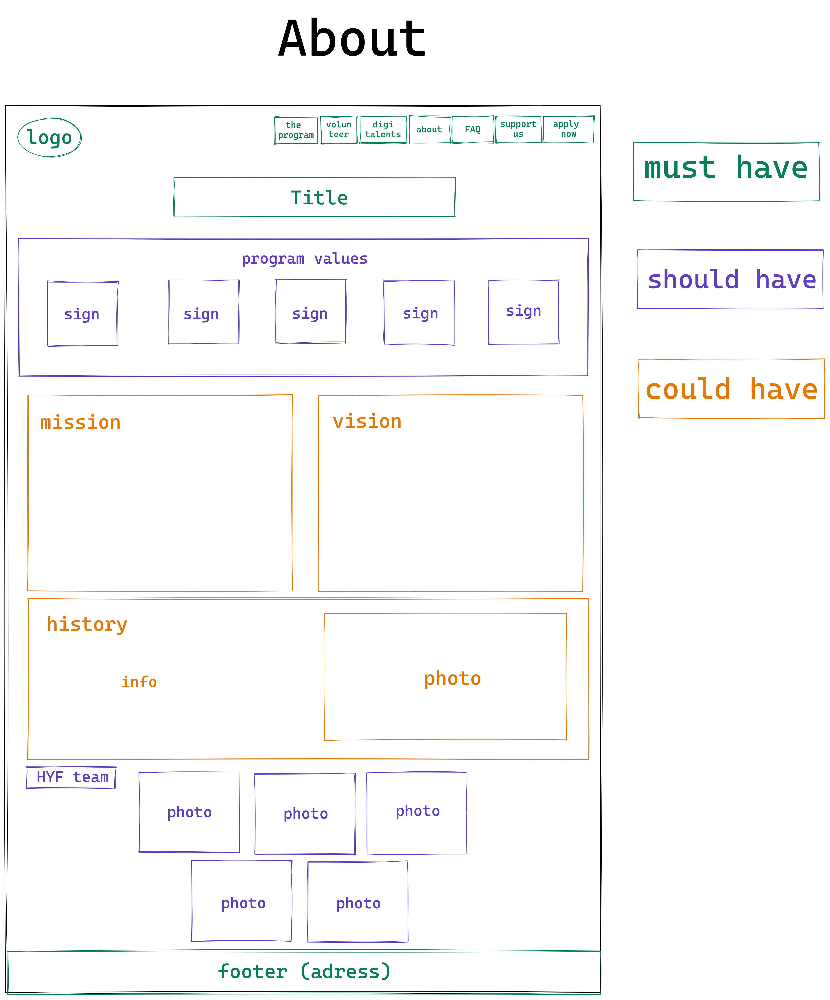

# Name of project  : Hack Your Future

> This is a website for helping new talent into the tech world

## Table of contents

- [Name of project](#name-of-project)
  - [Table of contents](#table-of-contents)
  - [General info](#general-info)
  - [Screenshots](#screenshots)
  - [Technologies](#technologies)
  - [Setup](#setup)
  - [Code Examples](#code-examples)
  - [Features](#features)
  - [Status](#status)
  - [Inspiration](#inspiration)
  - [Contact](#contact)
  - [Instructions for use](#instructions-for-use)
  - [Code Quality Checks](#code-quality-checks)
  - [Continuous Integration (CI)](#continuous-integration-ci)
  - [Repo Setup](#repo-setup)

## General info

> Hack Your Future is a website for helping new talent into the tech world


### Screenshots







### Technologies

1. HTML
2. CSS
3. Grid
4. Flexbox
5. Node 14.16.0
6. JavaScript
7. VSC code


## Setup

## Code Quality Checks

- `npm run format`: Makes sure all the code in this repository is well-formatted
  (looks good).
- `npm run lint:ls`: Checks to make sure all folder and file names match the
  repository conventions.
- `npm run lint:md`: Will lint all of the Markdown files in this repository.
- `npm run lint:css`: Will lint all of the CSS files in this repository.
- `npm run validate:html`: Validates all HTML files in your project.
- `npm run spell-check`: Goes through all the files in this repository looking
  for words it doesn't recognize. Just because it says something is a mistake
  doesn't mean it is! It doesn't know every word in the world. You can add new
  correct words to the [./.cspell.json](./.cspell.json) file so they won't cause
  an error.
- `npm run accessibility -- ./path/to/file.html`: Runs an accessibility analysis
  on all HTML files in the given path and writes the report to
  `/accessibility_report`


## Code examples

```HTML
//
<h3 class="">Hack Your Future (part of Open Knowledge Belgium)</h3>
<p class="footer-link">
  Open Knowledge Belgium vzw <br />Cantersteen 12 <br />1000 Bruxelles
  <br />

  <a href="mailto:contact@hackyourfuture.be" class="footer-link"
  >contact@hackyourfuture.be</a
  >
</p>
```


## Features

List of features ready and Todos for future development

- 
-
-

To-do list:

-
-

## Status

Project is: _in progress_

## Inspiration

Project by Hack Your Future Belgium

## Contact

[HYF-Class19-Group1 - Agile - Hack Your Future webSite Rebuild](https://hyf-class19.github.io/agile-development-hyf-group-1/)

## Group Members

| Name                | GitHub Links                                        |
|---------------------|-----------------------------------------------------|
| **Anas Abbar**      | [anasabbar](https://github.com/anasabbar)           |
| **Elnura**          | [Elya88](https://github.com/Elya88)                 | 
| **Michael Mugaiga** | [MichaelMugaiga](https://github.com/MichaelMugaiga) |
| **Thomas Ayissi**   | [thomas-ayissi](https://github.com/thomas-ayissi)   |
| **Valeriya**        | [V-Valkiriya](https://github.com/V-Valkiriya)       |

## Instructions for use

1. `git clone git@github.com:HackYourFutureBelgium/template-markdown.git`
2. `cd template-markdown`
3. `npm install`

## Code Quality Checks

- `npm run format`: Makes sure all the code in this repository is well-formatted
  (looks good).
- `npm run lint:ls`: Checks to make sure all folder and file names match the
  repository conventions.
- `npm run lint:md`: Will lint all of the Markdown files in this repository.
- `npm run lint:css`: Will lint all of the CSS files in this repository.
- `npm run validate:html`: Validates all HTML files in your project.
- `npm run spell-check`: Goes through all the files in this repository looking
  for words it doesn't recognize. Just because it says something is a mistake
  doesn't mean it is! It doesn't know every word in the world. You can add new
  correct words to the [./.cspell.json](./.cspell.json) file so they won't cause
  an error.
- `npm run accessibility -- ./path/to/file.html`: Runs an accessibility analysis
  on all HTML files in the given path and writes the report to
  `/accessibility_report`

## Continuous Integration (CI)

When you open a PR to `main`/`master` in your repository, GitHub will
automatically do a linting check on the code in this repository, you can see
this in the[./.github/workflows/lint.yml](./.github/workflows/lint.yml) file.

If the linting fails, you will not be able to merge the PR. You can double check
that your code will pass before pushing by running the code quality scripts
locally.

## Repo Setup

<details>
<summary>Repo Setup</summary>

- Give each member _write_ access to the repo (if it's a group project)
- Turn on GitHub Pages and put a link to your website in the repo's description
- Turn on GitHub Actions
- in the _Branches_ section of your repo's settings make sure:
  - The repository
    [requires a review](https://github.blog/2018-03-23-require-multiple-reviewers/)
    before pull requests can be merged.
  - The `master`/`main` branch must "_Require status checks to pass before
    merging_"
  - The `master`/`main` branch must "_Require require branches to be up to date
    before merging_"

</details>
